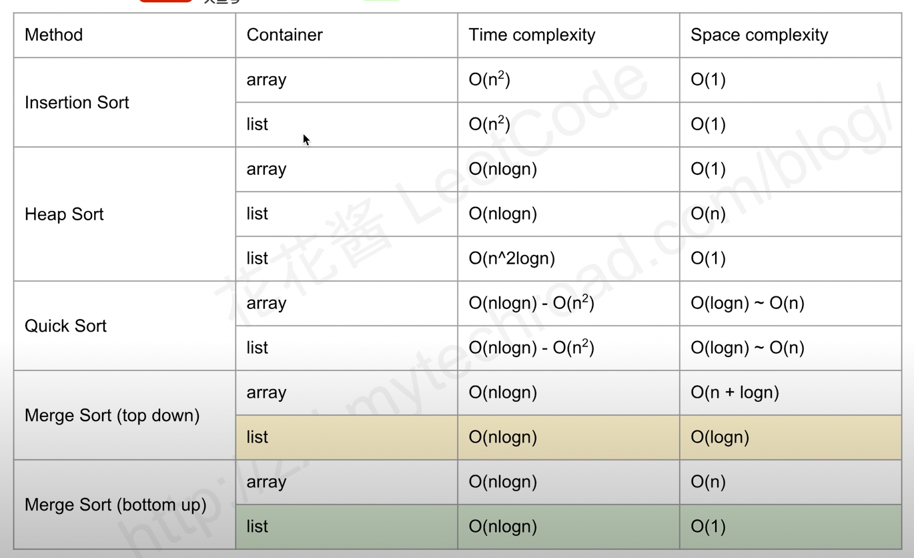

# Sort List

Difficulty: Medium
TimeComplexity: O(n log n)
SpaceComplexity: O(log n)



Question:
---

Sort a linked list in O(n log n) time using constant space complexity.

Example 1
---
```bash
Input: 4->2->1->3
Output: 1->2->3->4
```

```bash
Input: -1->5->3->4->0
Output: -1->0->3->4->5
```

题目大意
---
链表的排序，要求时间复杂度必须是 O(n log n)，空间复杂度是 O(1)


解题思路
---
这道题只能用归并排序才能符合要求。归并排序需要的 2 个操作在其他题目已经出现过了，取中间点是第 876 题，合并 2 个有序链表是第 21 题。